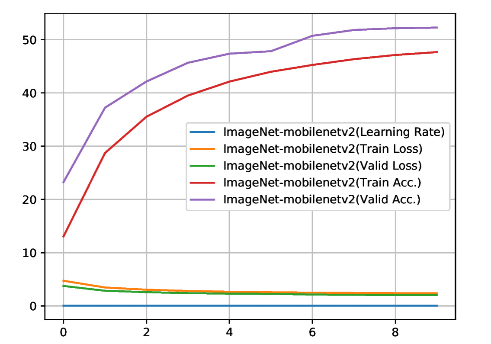
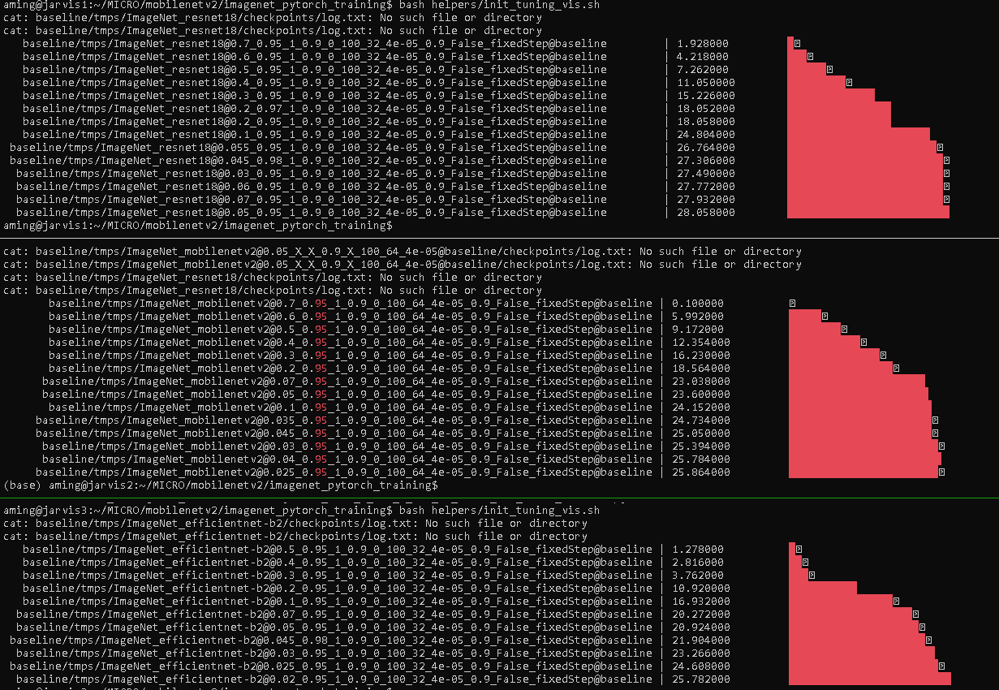

# PyTorch Implemention of Dropback


Edited from reproduction of MobileNet V2 architecture as described in [MobileNetV2: Inverted Residuals and Linear Bottlenecks](https://arxiv.org/abs/1801.04381)


| Table of Contents |  |
|-------------------|--|
| Tuning            |  |
| Things to set     |  |
| Parameter counts  |  |
| Dataset           |  |
| Test              |  |
| Clusters          |  |
| File transfer     |  |


## Tuning
For training, just change the model name in tuneIt.sh file and run `bash tuneIt.sh`

Hierarchy:

```
runOnCluster.sh [model_name, sub-conf, folder]
└── tune.sh > tuning.log
    ├── tuning.py [*model_name] > tuning.runs
    └── submit_tune.sh
        └── RunBench[_beluga/_jarvis].slurm
            └── run_tune.sh (inside Singularity)
                └── imagenet_dropback.py [generated_tuning_arguments]
```

The output of each training is at: `tuning/_config_/_runName_jobArrayId.std[out/error]`
The log of each training is at: `tuning/tmps/_run_name@_config_@_folder_/checkpoints/log.txt`

Each RunBench have diff groups, partition, scheduling time, singularity dir binding.
the submit_tune.sh script will automatically figure out which cluster you are using now by simple pattern matching on the hostname.

 + Local: RunBench_jarvis.slurm: Jarvis2: [vip partition, Max 3 days] , Jarvis1,3: [No vip partition, Max 2 days]
 + Compute Canada: RunBench_beluga.slurm: No vip partition. ( Too slow ... giving up on it ... !! 
   RunBench_cedar.slurm: (TODO)
  
 

The job name that is passed to RunBench.slurm has 3 field separated by '@': e.g. `ImageNet_mobileNetv2@0.0625_0.25_2_0.9_2000000_10_64_4e-05_0_False_fixedStep@tuning`
config is passed like this: `0.0625_0.18_2_0.9_2000000_10_64_4e-05_0_True_fixedStep

e.g. output: `tuning/0.0625_0.18_2_0.9_2000000_10_64_4e-05_0_False_fixedStep/ImageNet_mobileNetv2_2201_1.stdout`
e.g. log: `tuning/tmps/ImageNet_mobileNetv2@0.0625_0.25_2_0.9_2000000_10_64_4e-05_0_False_fixedStep@tuning/checkpoints/log.txt`

### Helper functions

 + cancel_job.sh
 + check_log.sh: reports accuracy for specific jobId
 + summary_all_models.sh
 + tuning_best.sh: reports best accuracy for group of training
 + tuning_worst.sh

NOTE: put this in your ~/.bashrc file: `alias squeueMe='nvidia-smi2;squeue -u aming -o "%.18i %80j %20S %10L %.10M %.6D %.2t"'

### Things to set

in `model/parameters.json` ****:
 - add the tuning parameters in json(dictionary) format for each model and sub-configuration

in `tuneIt.sh` ***:
 - FILTER='_1000000': which configuration(s) to collect the best accuracy on. Typically it's _[#track_size]

in `submit_tune.sh` and `RunBench.slurm`:
 - ws='/home/aming/MICRO/mobilenetv2/imagenet_pytorch_training': path for scripts
 - rs='/home/aming/MICRO/mobilenetv2/imagenet_pytorch_training': path to dump outputs

in `RunBench.slurm`:
 - SING_IMG='DB0220.simg': which singularity image to use (assuming it's in home directory)


## Parameters

Result of `bash summary_all_models.sh` (missing efficientnet-bx capability):

|Model             | tested |parameter count  ||Model              | tested |parameter count  |
|------------------|--------|----------------:||-------------------|--------|----------------:|
|alexnet           |        |         61100840|| resnet18          |        |        11689512 |
|densenet121       |        |     7978856     || resnet34          |        |        21797672 |
|densenet161       |        |     28681000    || resnet50          |        |        25557032 |
|densenet169       |        |     14149480    || resnext101_32x8d  |        |        88791336 |
|densenet201       |        |     20013928    || resnext50_32x4d   |        |         25028904|
|mobilenetv2       |   X    |     3504872     || squeezenet1_0     |        |   1248424       |
|mobilenet_v2      |   X    |    3504872      || squeezenet1_1     |        |   1235496       |
|shufflenet_v2_x0_5|   X    |      1366792    || vgg11             |        |   132863336     |
|shufflenet_v2_x1_0|   X    |      2278604    || vgg11_bn          |        |        132868840|
|shufflenet_v2_x1_5|   X    |      3503624    || vgg13             |        |   133047848     |
|shufflenet_v2_x2_0|   X    |      7393996    || vgg13_bn          |        |        133053736|
|inception_v3      |        |    27161264     || vgg16             |        |   138357544     |
|mnasnet0_5        |        |      2218512    || vgg16_bn          |        |        138365992|
|mnasnet0_75       |        |     3170208     || vgg19             |        |   143667240     |
|mnasnet1_0        |        |      4383312    || vgg19_bn          |        |        143678248|
|mnasnet1_3        |        |      6282256    || wide_resnet101_2  |        |        126886696|
|resnet101         |        |       44549160  || wide_resnet50_2   |        |         68883240|
|resnet152         |        |       60192808  || googlenet         |        |       13004888  |
| efficientnet-b0  |   X    |       5288548   || efficientnet-b2   |   X    |        9109994  |


## Dataset
ImageNet (ILSVRC2012) dataset on Jarvis2: `/datasets/IMAGENET-UNCROPPED/`

### Test 
on 10 epoch 

### Init tuning
on the first epoch - baseline 

## Clusters

Jarvis2

  - ask for vip partition (#SBATCH -p vip)

Compute Canada Beluga:

  - Run under def-mieszko (#SBATCH --account=def-mieszko)
  - Up to 7 days
  - Min time limit of 1 hour per job
  - Max 1000 running jobs
  - /scratch have a max of #1000K files limitation ( moving IMAGENET to /project)
  - Files under /project should have the `group=def-mieszko`
  - Cluster info: run `partition-stats` command
  - Priority stats: run `sshare -l` command
  - Need to load singularity (done in RunBench) if using the Singularity image (i.e. module load singularity)
  - Need to load correct version of python `module load python/3.7.4` (put it in ~/.bashrc)
  - Transfer large data: https://globus.computecanada.ca (https://docs.computecanada.ca/wiki/Globus)
  - Scheduling info: https://docs.computecanada.ca/wiki/Job_scheduling_policies
  - GPU info: https://docs.computecanada.ca/wiki/Using_GPUs_with_Slurm


## File transfer

You need to transfer files with `def-mieszko` group so you don't exceed the quota on /projcts:

For example moving files from /scratch: `rsync --info=progress2 --chown=aming:def-mieszko -r /scratch/aming/IMAGENET-UNCROPPED /project/def-mieszko/aming/`

parallel data movement:

```

ls /scratch/aming/IMAGENET-UNCROPPED/train/ | xargs -n1 -P32 -I% rsync --info=progress2 --chown=aming:def-mieszko -r /scratch/aming/IMAGENET-UNCROPPED/train/% /project/def-mieszko/aming/IMAGENET-UNCROPPED/train/
ls /scratch/aming/IMAGENET-UNCROPPED/val/   | xargs -n1 -P32 -I% rsync --info=progress2 --chown=aming:def-mieszko -r /scratch/aming/IMAGENET-UNCROPPED/val/%   /project/def-mieszko/aming/IMAGENET-UNCROPPED/val/

```

Moving from Jarvis2 to Beluga:


```
salloc -c 32 --time=24:00:00
ls  -1 /datasets/IMAGENET-UNCROPPED/train/ | xargs -n1 -P32 -I% rsync --info=progress2 --chown=aming:def-mieszko -r -e ssh /datasets/IMAGENET-UNCROPPED/train/% aming@beluga.computecanada.ca:/project/def-mieszko/aming/IMAGENET-UNCROPPED/train/
ls  -1 /datasets/IMAGENET-UNCROPPED/val/   | xargs -n1 -P32 -I% rsync --info=progress2 --chown=aming:def-mieszko -r -e ssh /datasets/IMAGENET-UNCROPPED/val/% aming@beluga.computecanada.ca:/project/def-mieszko/aming/IMAGENET-UNCROPPED/val/

```

Run the following to test copy speed:
`bash test_transfer.sh`

The output will be :

```
/project/def-mieszko/aming --> /project/def-mieszko/aming:
test.tar.gz                                                                                                                                                        100%  145MB 205.7MB/s   00:00
/project/def-mieszko/aming --> /home/aming:
test.tar.gz                                                                                                                                                        100%  145MB 217.3MB/s   00:00
/project/def-mieszko/aming --> /scratch/aming:
test.tar.gz                                                                                                                                                        100%  145MB 220.6MB/s   00:00
/home/aming --> /project/def-mieszko/aming:
test.tar.gz                                                                                                                                                        100%  145MB 219.7MB/s   00:00
/home/aming --> /home/aming:
test.tar.gz                                                                                                                                                        100%  145MB 219.7MB/s   00:00
/home/aming --> /scratch/aming:
test.tar.gz                                                                                                                                                        100%  145MB 220.0MB/s   00:00
/scratch/aming --> /project/def-mieszko/aming:
test.tar.gz                                                                                                                                                        100%  145MB 216.1MB/s   00:00
/scratch/aming --> /home/aming:
test.tar.gz                                                                                                                                                        100%  145MB 217.8MB/s   00:00
/scratch/aming --> /scratch/aming:
test.tar.gz                                                                                                                                                        100%  145MB 218.2MB/s   00:00
```

Run the following commands to test drive Wr/Rd speed:

`cd /drive_to_test/user/...`

Writing: 
`sync; dd if=/dev/zero of=tempfile bs=1M count=1024; sync`

output:

```
1024+0 records in
1024+0 records out
1073741824 bytes (1.1 GB, 1.0 GiB) copied, 0.993727 s, 1.1 GB/s
```

Reading: 
`dd if=tempfile of=/dev/null bs=1M count=1024`

```
1024+0 records in
1024+0 records out
1073741824 bytes (1.1 GB, 1.0 GiB) copied, 0.251305 s, 4.3 GB/
```
